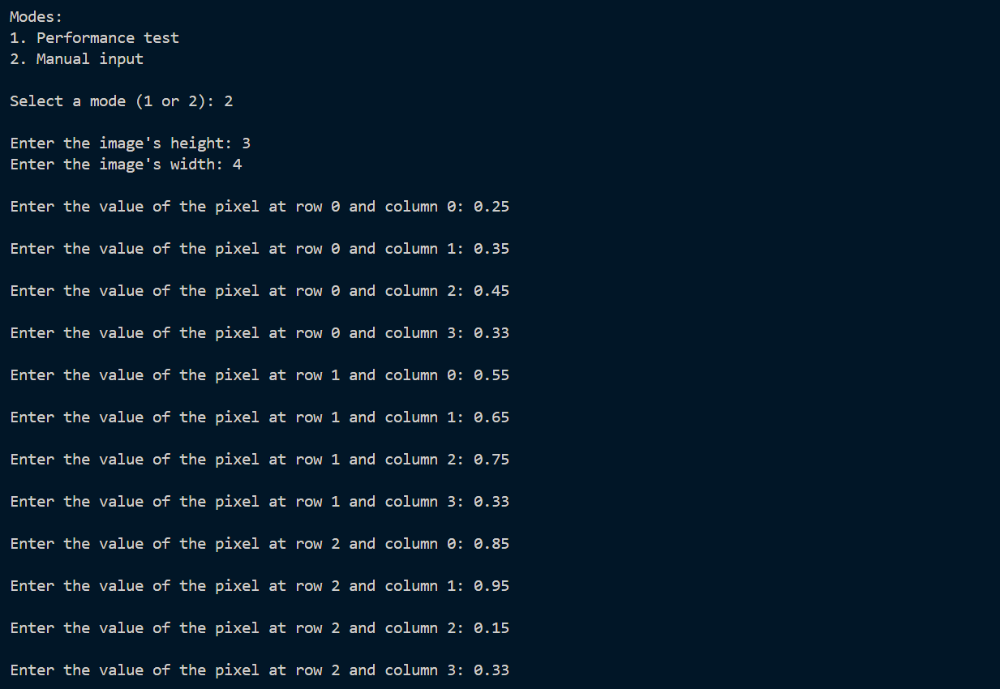
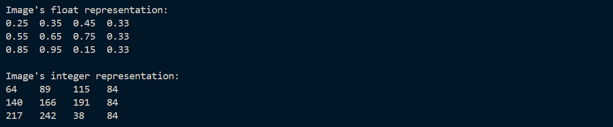
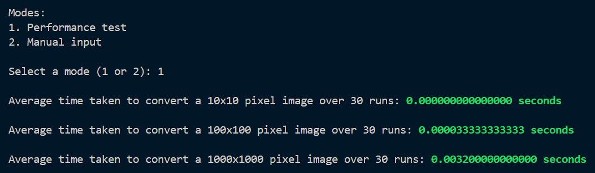

# lbyarch-mp2 <!-- omit from toc -->

A C program that interfaces with x86 to convert a float-based representation of grayscale images into an integer-based representation.

Created for LBYARCH (Introduction to Computer Organization and Architecture Laboratory).

---

## Table of Contents <!-- omit from toc -->

- [How to Build and Run](#how-to-build-and-run)
  - [Prerequisites](#prerequisites)
  - [Building and Running the Program](#building-and-running-the-program)
    - [Option 1: Using Make](#option-1-using-make)
    - [Option 2: Manual Build](#option-2-manual-build)
- [Sample Program Runs](#sample-program-runs)
  - [Manual Input Mode](#manual-input-mode)
  - [Performance Test Mode](#performance-test-mode)
- [Authors](#authors)

---

## How to Build and Run

### Prerequisites
- [NASM](https://www.nasm.us/) - for assembling x86-64 code
- [GCC](https://gcc.gnu.org/) - for compiling C code
- [Make](https://www.gnu.org/software/make/) - for automated building (optional)

### Building and Running the Program

> **Note:**
> The following commands assume you are using **Windows CMD**.

#### Option 1: Using Make
```cmd
# Clone the repository
git clone https://github.com/qu1r0ra/lbyarch-mp2.git
cd lbyarch-mp2

# Build and run the program
make build
make run
```

#### Option 2: Manual Build
```cmd
# Clone the repository
git clone https://github.com/qu1r0ra/lbyarch-mp2.git
cd lbyarch-mp2

# Create build directories
mkdir build
mkdir bin

# Build and run the program
nasm -f win64 src/asmfile.asm -o build/asmfile.obj
gcc -c src/cfile.c -o build/cfile.obj -m64 -std=c99
gcc build/cfile.obj build/asmfile.obj -o bin/a.exe -m64
bin\a.exe
```

---

## Sample Program Runs

### Manual Input Mode




### Performance Test Mode



The performance test above shows that the image representation conversion function implemented in x86 is *very efficient*.

Converting 10x10 pixel image representations on a *Thinkpad T480 with an i7 8th Gen* was virtually instantaneous, taking a negligible amount of time not large enough to be recognized by a double datatype in C.

It only became recognizable when 100x100 pixel image representations were provided as input. On average, it took around $3.33\times 10^{-5}$ seconds or $33.33$ microseconds to convert each of them.

Finally, 1000x1000 pixel image representations each took on average around $3.20\times 10^{-3}$ seconds or $3.20$ milliseconds to convert.

---

## Authors

The following students of De La Salle University - Manila, Philippines collaborated on this project:

<table>
  <thead>
    <tr>
      <th>Profile</th>
      <th>Author</th>
      <th>Contributions</th>
    </tr>
  </thead>
  <tbody>
    <tr>
      <td align="center">
        
      </td>
      <td>
        <strong>Christian Joseph Bunyi</strong>  
        <br />
        <a href="https://github.com/qu1r0ra">@qu1r0ra</a>
      </td>
      <td>
        <ul>
          <li>Created and maintained the GitHub repository.</li>
          <li>Wrote the README.</li>
          <li>Wrote the C code.</li>
          <li>Wrote skeletal x86 code.</li>
        </ul>
      </td>
    </tr>
    <tr>
      <td align="center">
        
      </td>
      <td>
        <strong>Brent Jan Soan</strong>  
        <br />
        <a href="https://github.com/brent-soan">@brent-soan</a>
      </td>
      <td>
        <ul>
          <li>Implemented the image representation conversion assembly function.</li>
        </ul>
      </td>
    </tr>
  </tbody>
</table>
